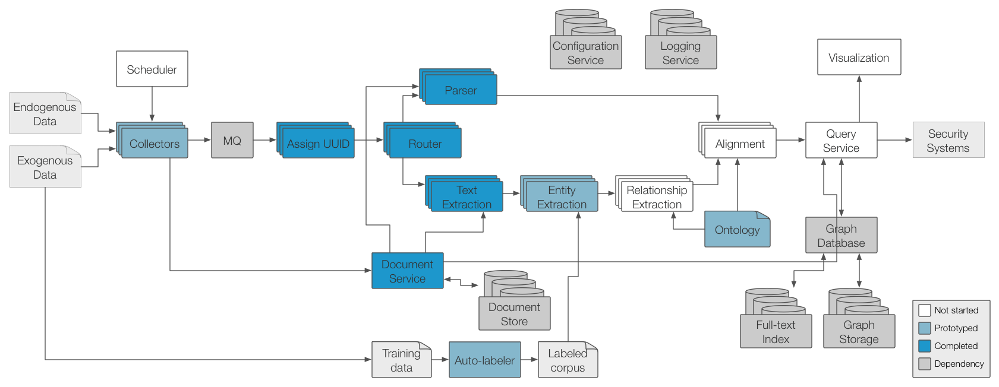

# Stucco Architecture

In general, the following guidelines should be followed:

* Configuration files should be defined in [yaml](http://yaml.org/)
* Messages between services should be formatted as [JSON](http://json.org/) and sent via HTTP
* Logs should be sent to [logstash](http://logstash.net/) as JSON via the [TCP Input](http://logstash.net/docs/1.2.1/inputs/tcp)
* Messages into Storm should be via AMQP using [RabbitMQ](http://www.rabbitmq.com/)

---------------------------------------------------------------------

## Collection

### Description

The collectors pull data or process data streams and push the collected data (documents) into the message queue. Each type of collector is independent of others. The collectors can be implemented in any language. 

Collectors can either send messages with data or messages without data. For messages without data, the collector will add the document to the document store and attach the returned `id` to the message.

Collectors can either be stand-alone and run on any host, or be host-based and designed to collect data specific to that host.

### Collector Types

#### Web collector

Web collectors pull a document via HTTP/HTTPS given a URL. Documents will be decompressed, but no other processing will occur. 

##### Configuration

**TODO.**

##### Content format

Various (e.g. HTML, XML, CSV). 

#### Scraping collector

Scrapers pull data embedded within a web page via HTTP/HTTPS given a URL and an HTML pattern. 

##### Configuration

**TODO.**

##### Content format

HTML.

#### RSS collector

RSS collectors pull an RSS/ATOM feed via HTTP/HTTPS given a URL.

##### Configuration

**TODO.**

##### Content format

XML.

#### Twitter collector

Twitter collectors pull Tweet data via HTTP from the Twitter Search REST API given a user (@username), hashtag (#keyword), or search term.

##### Configuration

Twitter API Key
Keywords and/or usernames to track

##### Content format

JSON.

#### Netflow collector

Netflow collectors will collect from [Argus](http://www.qosient.com/argus/). The collector will listen for argus streams using `ra` tool and convert to XML and pipe to send the flow data to the message queue as a string.

##### Configuration

**TODO.**

##### Content format

**TODO.**

#### Host-based collectors

Host-based collectors collect data from an individual host using agents.

Host-based collectors should be able to collect and forward:

* System logs
* [Hone](https://github.com/HoneProject/) data
* Installed packages

##### Configuration

**TODO.**

##### Content format

If we are writing the collector, JSON. If not, whatever format the agent uses.

### State

Stand-alone collectors may require state state (state should be stored with the scheduler, such as the last time a site was downloaded). Host-based collectors may need to store state (e.g. when the last collection was run).

### Input Transport Protocol

Input transport protocol will depend on the type of collector.

### Input Format

Input format will depend on the type of collector.

### Output Transport Protocol

[Advanced Message Queuing Protocol (AMQP)](http://www.amqp.org/)

### Output Format

There are two types of output messages: (1) messages with data and (2) messages without data that reference an ID in the document store.

All messages should be formatted as a JSON object.
All JSON messages should be converted to strings (i.e. using [JSON.stringify()](https://developer.mozilla.org/en-US/docs/Web/JavaScript/Reference/Global_Objects/JSON/stringify)).

All messages should contain the following fields. Either `document-id` or `content` must be included.

* `sourceName` (string) - the name of the source of the message; e.g. ‘cve’ (required)
* `sourceUrl` (string) - the url of the document – this should be a link to the document itself; e.g. http://cve.mitre.org/data/downloads/allitems.xml, Note: in some cases this URL will point to a generic URL that requires an API.
In those cases we will provide the URL and then describe whether we have an API call with it and what metadata was used to get the content from the site. (optional)
* `sourceMetadataUsed` (string) - will contain context specific metadata for the site being accessed.
For example if the URL requires a set of query terms or terms for access those are listed (optional)
* `dateCollected` (number) - the unix timestamp (i.e. date +%s) when the document was collected; e.g. 1377114034 (required)
* `collectorType` (string) - this defines the type content, whether exogenous or endogenous, enumerated types: WEBContent, hone, assets, netflow  (optional)
* `documentName` (string) - the name of the document represented by the message; e.g. ‘allitems’ (optional)
* `documentCreation` (number) - the unix timestamp (i.e. date +%s) of the document creation; e.g. 1365012038 (optional)
* `documentModification` (number) - the unix timestamp (i.e. date +%s) of the document creation; e.g. 1366135032 (optional)
* `contentType` (string) - the MIME type of the message; e.g. text/xml @see http://www.iana.org/assignments/media-types (required)
* `content` (base64 encoded string) - the JSON object to send to Storm, currently BASE64 encoded  (optional)
* `documentId` (string) - the ID provided by the document store; only provide an ID if content is not provided (optional)

An example output would be:

// TODO - ADD EXAMPLE

---------------------------------------------------------------------

## Scheduler

### Description

### Configuration

### State

---------------------------------------------------------------------

## Message Queue (MQ)

### Description

The message queue accepts input (documents) from the collectors and pushes the documents into the processing pipeline.
The collectors should send data into the default exchange, the queue named `stucco`. The message queue is implemented with RabbitMQ, which utilizes the AMQP standard.

### State

The queue should hold messages until they have been processed by the Storm Spout.

### Input format

The message queue should pass on the data as is from collectors.

### Output format

The message queue should pass on the data as is from collectors.

---------------------------------------------------------------------

## RT (Storm)

### Description

[RT](https://github.com/stucco/rt) is the Real-time processing component of Stucco implemented as a [Storm](http://storm-project.net/) cluster.

This diagram shows how all the RT components are connected. The diagram at the very top shows how RT connects to the other components described in this document.

If the data it receives is not already included in the document store, it will be added.

The data it receives will be transformed into a graph, consistent with the [ontology definition](https://github.com/stucco/ontology), and then added into the Titan instance.

### Configuration

config.yaml file sets several options related to the AMQP queue and the number of bolt instances.

### Input Transport Protocol
[See AMQP Spout](https://github.com/stucco/docs/blob/master/docs/arch-v1.md#amqp-spout)

### Input Format
[See AMQP Spout](https://github.com/stucco/docs/blob/master/docs/arch-v1.md#amqp-spout)

The spout will send an acknowledgement to the queue when the messages are received, so that the queue can release these resources.

### Output Transport Protocol
[See Graph Bolt](https://github.com/stucco/docs/blob/master/docs/arch-v1.md#graph-bolt)

### Output Format
[See Graph Bolt](https://github.com/stucco/docs/blob/master/docs/arch-v1.md#graph-bolt)

RT will also add the raw documents it receives to the document store if needed.

RT may add additional intermediate output (eg. partially labeled text documents) to the document store if needed.

### RT Components

#### AMQP Spout

##### Description
The AMQP spout pulls messages off the queue and pushes them to the UUID Bolt. 

##### Input Transport Protocol
[Advanced Message Queuing Protocol (AMQP)](http://www.amqp.org/)

##### Input Format

[See Collector's Output Format](#output-format)

##### Output Transport Protocol
[Storm's Multilang Protocol](https://github.com/nathanmarz/storm/wiki/Multilang-protocol)

##### Output Format
JSON object with the following fields:

* `json` (string) - the JSON message

#### UUID Bolt

##### Description
The UUID bolt generates and appends a universally unique identifier (UUID) to the message tuples.

The UUID is generated by computing a SHA-512 hash of the input string so that the UUID is deterministic based on the input.

##### Input Transport Protocol
[Storm's Multilang Protocol](https://github.com/nathanmarz/storm/wiki/Multilang-protocol)

##### Input Format
JSON object with the following fields:

* `json` (string) - the JSON message

##### Output Transport Protocol
[Storm's Multilang Protocol](https://github.com/nathanmarz/storm/wiki/Multilang-protocol)

##### Output Format
JSON object with the following fields:

* `uuid` (string) - the hash of the JSON message
* `json` (string) - the JSON message

#### Route Bolt

##### Description
The Route bolt sends a tuple to the appropriate pipeline, depending on whether the tuple contains a structured document or unstructured document.

##### Input Transport Protocol
[Storm's Multilang Protocol](https://github.com/nathanmarz/storm/wiki/Multilang-protocol)

##### Input Format
JSON object with the following fields:

* `uuid` (string) - the hash of the JSON message
* `json` (string) - the JSON message

##### Output Transport Protocol
[Storm's Multilang Protocol](https://github.com/nathanmarz/storm/wiki/Multilang-protocol)

##### Output Format
JSON object with the following fields are submitted to either the "structured" or "unstructured" stream:

* `uuid` (string) - the hash of the JSON message
* `json` (string) - the JSON message

#### Parse Bolt

##### Description
The Parse bolt parses a structured document and produces its corresponding subgraph.

##### Input Transport Protocol
[Storm's Multilang Protocol](https://github.com/nathanmarz/storm/wiki/Multilang-protocol)

##### Input Format
JSON object with the following fields:

* `uuid` (string) - the hash of the JSON message
* `json` (string) - the JSON message

##### Output Transport Protocol
[Storm's Multilang Protocol](https://github.com/nathanmarz/storm/wiki/Multilang-protocol)

##### Output Format
JSON object with the following fields:

* `uuid` (string) - the hash of the JSON message
* `graph` (string) - the GraphSON version of the structured document

#### Extract Bolt

##### Description
The Extract bolt extracts an unstructured document's content either from the message, or by requesting the document from the document-service. The document content is then passed to bolts that can find domain-specific concepts.

##### Input Transport Protocol
[Storm's Multilang Protocol](https://github.com/nathanmarz/storm/wiki/Multilang-protocol)

##### Input Format
JSON object with the following fields:

* `uuid` (string) - the hash of the JSON message
* `json` (string) - the JSON message

##### Output Transport Protocol
[Storm's Multilang Protocol](https://github.com/nathanmarz/storm/wiki/Multilang-protocol)

##### Output Format
JSON object with the following fields:

* `uuid` (string) - the hash of the JSON message
* `text` (string) - the unstructured text from the document

#### Concept Bolt

##### Description
The Concept bolt finds domain-specific concepts within unstructured text.

##### Input Transport Protocol
[Storm's Multilang Protocol](https://github.com/nathanmarz/storm/wiki/Multilang-protocol)

##### Input Format
JSON object with the following fields:

* `uuid` (string) - the hash of the JSON message
* `text` (string) - the unstructured text from the document

##### Output Transport Protocol
[Storm's Multilang Protocol](https://github.com/nathanmarz/storm/wiki/Multilang-protocol)

##### Output Format
JSON object with the following fields:

* `uuid` (string) - the hash of the JSON message
* `text` (string) - the unstructured text from the document
* `concepts` (string) - JSON object representing the domain-specific concepts

#### Relation Bolt

##### Description
The Relation bolt discovers relationships between the concepts and constructs a subgraph of this knowledge.

##### Input Transport Protocol
[Storm's Multilang Protocol](https://github.com/nathanmarz/storm/wiki/Multilang-protocol)

##### Input Format
JSON object with the following fields:

* `uuid` (string) - the hash of the JSON message
* `text` (string) - the unstructured text from the document
* `concepts` (string) - JSON object representing the domain-specific concepts

##### Output Transport Protocol
[Storm's Multilang Protocol](https://github.com/nathanmarz/storm/wiki/Multilang-protocol)

##### Output Format
JSON object with the following fields:

* `uuid` (string) - the hash of the JSON message
* `graph` (string) - the GraphSON representation of the unstructured document's concepts (nodes) and relationships (edges)

#### Graph Bolt

##### Description
The Graph bolt aligns and merges the new subgraph into the full knowledge graph.

##### Input Transport Protocol
[Storm's Multilang Protocol](https://github.com/nathanmarz/storm/wiki/Multilang-protocol)

##### Input Format
JSON object with the following fields:

* `uuid` (string) - the hash of the JSON message
* `graph` (string) - the GraphSON subgraph representing a document

##### Output Transport Protocol
HTTP/REST

##### Output Format
GraphSON subgraph representing a document

---------------------------------------------------------------------

## Document Service

### Description

The [document-service](https://github.com/stucco/document-service) stores and makes available the raw documents. The backend storage for the document service is implemented in [Riak](http://basho.com/riak/).

### Commands

#### Add Document

Be sure to set the `content-type` of the HTTP header when adding documents to the appropriate type (e.g. `content-type: application/json` for JSON data or `content-type: application/pdf` for PDF files.

Routes:

* PUT `server:port/document` - add a document and autogenerate an id
* PUT `server:port/document/id` - add a document with a specific id

#### Get Document

The `accept-encoding` can be set to `gzip` to compress the communication (i.e., `accept-encoding: application/gzip`).

The `accept` command can be one of the following: `application/json`, `text/plain`, or `application/octet-stream`. Use `application/octet-stream` for PDF files and other binary data.

Routes:

* GET `server:port/document/id` - retrieve a document based on the specific id

### Input Transport Protocol

HTTP.

### Input format

[See Collector's Output Format](#output-format)

### Output Transport Protocol

HTTP.

### Output format

JSON.

---------------------------------------------------------------------

## Query Service

### Description

The Query Service provides the API for the Graph Store to allow the Alignment bolt, the Visualization/UI, and any third-party applications to interface with the graph database.  

This API provides a [GraphSON](https://github.com/tinkerpop/blueprints/wiki/GraphSON-Reader-and-Writer-Library) interface over HTTP.

The API will provide functions that facilitate common operations (eg. get a node by ID) and also allow arbitrary [Gremlin](https://github.com/tinkerpop/gremlin/wiki) queries.  (As the API matures, the use of arbitrary Gremlin queries will be removed or restricted to the Alignment bolt only.)

The API will be implemented with Rexter and a set of [Rexter Extensions.](https://github.com/tinkerpop/rexster/wiki/Extensions)

### Routes

* `host:port/graphs/stucco/type/<typename>`  
  Returns a list of all nodes of type `<typename>`
* `host:port/graphs/stucco/node/<nodename>`  
  Returns the node with the specified `<nodename>`
* `host:port/graphs/stucco/tp/gremlin?<gremlinquery>`  
  Runs the given `<gremlinquery>` and returns any results

### Transport Protocol

HTTP.

### Transport Format

GraphSON.

---------------------------------------------------------------------

## Configuration Service

### Description

The configuration service hosts configuration information for all services. It is implemented in [etcd](http://coreos.com/using-coreos/etcd/).

### Configuration

The `etcd` configuration is [described here](https://github.com/coreos/etcd/blob/master/Documentation/configuration.md#configuration-file). The default stucco configuration is loaded into `etcd` when instantiated by the [config-loader](https://github.com/stucco/config-loader).  The default stucco configuration, [`stucco.yml`](https://github.com/stucco/config/blob/master/stucco.yml) is in the [config repo](https://github.com/stucco/config); edit that file to have the configuration changes loaded. The nested configuration in the `stucco.yml` gets translated to the url path, so, 

    stucco
      document-service
        port

Would be accessible using the following URL: `http://127.0.0.1:4001/v2/keys/stucco/document-service/port`.

### Usage

To communicate with the configuration service, either use HTTP or use [a client library](https://github.com/coreos/etcd/blob/master/Documentation/libraries-and-tools.md) that supports version 2. There is also a [command line client](https://github.com/coreos/etcdctl/). To test with HTTP, use `curl`:

    curl -L http://127.0.0.1:4001/v2/keys/mykey -XPUT -d value="this is awesome"
    curl -L http://127.0.0.1:4001/v2/keys/mykey

### Input Transport Protocol

HTTP/REST or using client library.

### Input Format

JSON (for HTTP), or specific to the client library used.

### Output Transport Protocol

JSON (for HTTP), or specific to the client library used.

### Output Format

HTTP/REST or using client library.

---------------------------------------------------------------------

## Logging Service

### Description

The logging service collects and aggregates logs from each of the components. The log server is implemented as a [logstash](http://logstash.net/) server with an [elasticsearch](http://www.elasticsearch.org/) backend. 

### Configuration

The logstash configuration for the TCP input should look like this:

input {
  tcp {
    type => "stucco-tcp"
    port => 9563
    charset => "UTF-8"
    format => "json_event"
  }
}

### Usage

Sending logs to the server should be done via the [TCP input plugin](http://logstash.net/docs/1.3.2/inputs/tcp). 

The Vagrant VM is set up with a logstash server to aggregate log files. Log files can be input in multiple ways. There is a simple configuration set up in the Vagrantfile. The easiest way to send logs is to send them over a TCP connection. For an example in node.js and python, see https://gist.github.com/jgoodall/6323951

### Input Transport Protocol

TCP, by default on port 9563.

### Input Format

JSON. The log message should be a stringified JSON object with the log message in the @message field. Optionally, an array of tags can be added to the @tags field. Additional fields can be added as an object to the @fields field as key-value pairs.

### Output

To view the logs, use HTTP with a web browser. The web interface to logstash is implemented by [kibana (v3)](http://www.elasticsearch.org/overview/kibana/).
